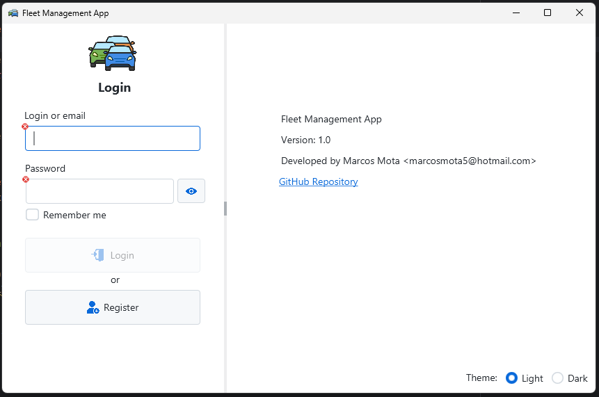
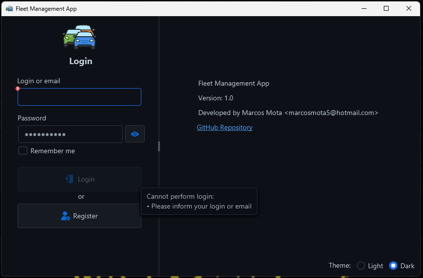
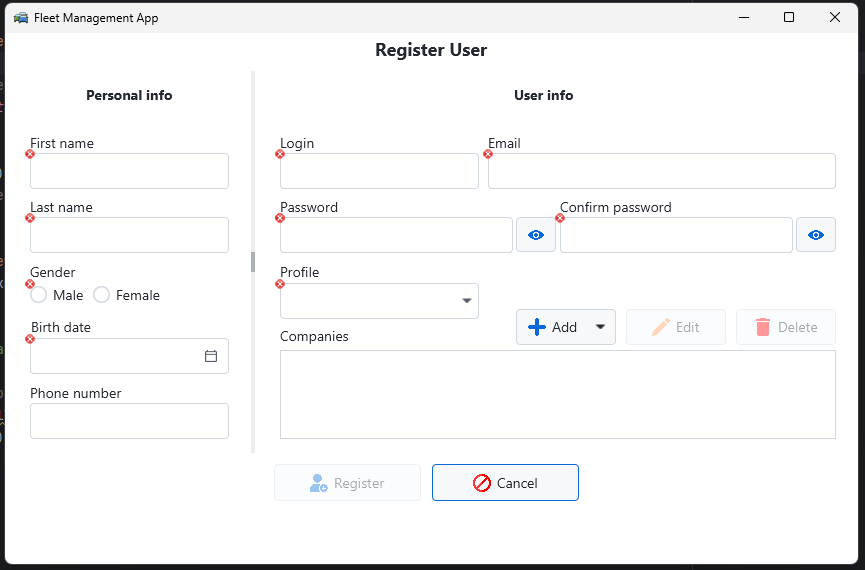
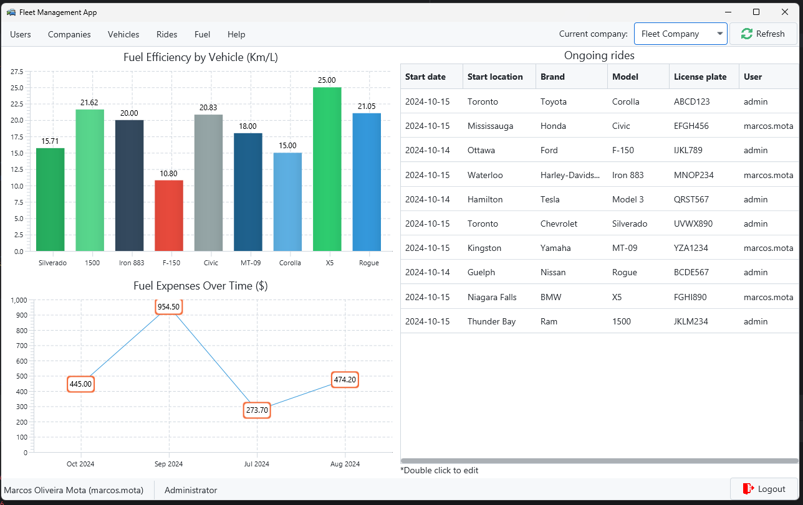
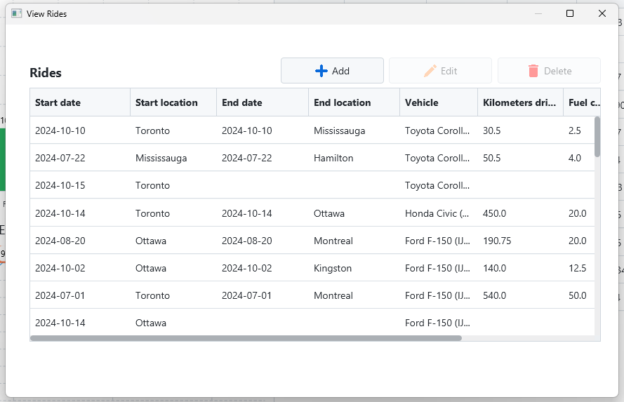
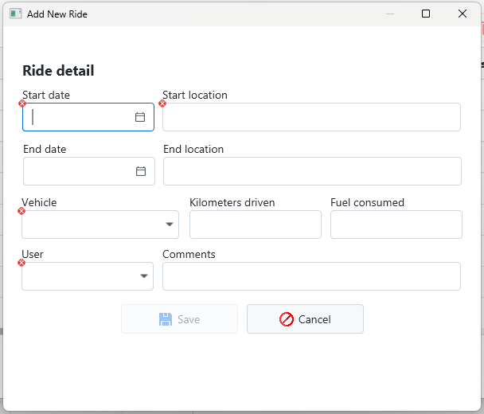

# FleetManagementApp

This is a repository of a JavaFX application created for an assignment, intended for learning purposes.

**Assignment Detail:** COMP1011 Assignment 1  
**Created on:** 2024-10-16

## Student Information

- **ID:** 200564426  
- **Name:** Marcos Oliveira Mota

## Description

FleetManagementApp is designed to help companies manage their vehicle fleets, which includes tracking employee rides and fuel consumption. The dashboard provides an overview of the company's fleet performance.

### Setup Instructions
To run the application:
1. Execute the `main_script.sql` file in your MySQL instance to set up the necessary database, tables, and procedures.
2. Ensure the `DbConnection` configuration matches your MySQL instance's details.

Note: Some features are still under development and have been disabled in the menu.

## Screenshots

### Login  

### Login in dark theme and showing validation  

### Register user page  

### Home page  

### Items management  

### Adding or editing item  

## Technologies Used

- **Java** - Main language
- **JavaFX** - Library for creating desktop apps
- **ValidationFX** - Library for field validation
- **AtlantaFX** - Library for applying modern light/dark themes
- **MySQL** - Database

## Contact

Check my <a href="https://github.com/marcosmota5" title="Profile">profile</a> for contact information.

## Other

A big thanks to <a href="https://www.flaticon.com/" title="Flaticon">Flaticon</a> for providing for free so many amazing images. Every single icon in this project comes from Flaticon, so all icon rights are reserved to it.